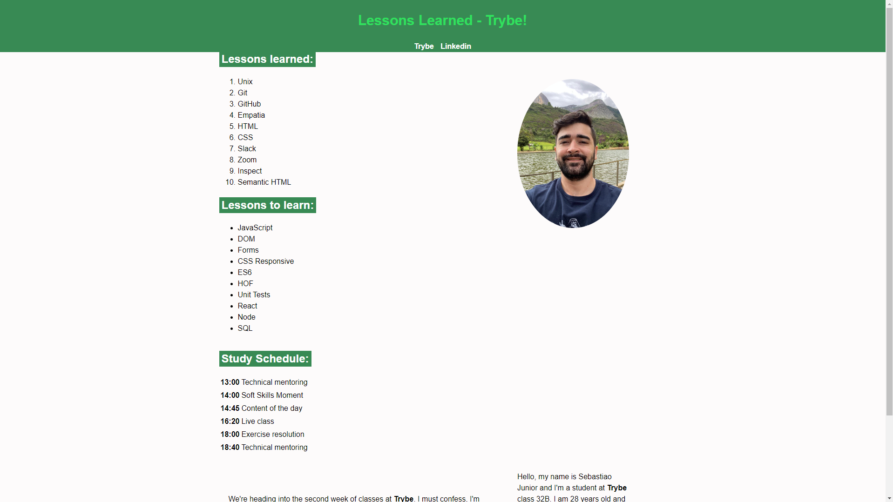

  <h1>📖 Lessons Learned 📖</h1>

My first project in the fundamentals module of Trybe marks the beginning of my journey in this course. This introductory task provided my first practical encounter with HTML and CSS, allowing me to apply the essential initial concepts for building and customizing web pages. #VQV🚀

## 👨‍💻 Language and Technologies used

  
<strong>🏗 Project structure</strong>
 

Built files:
📁 index.html
📁 style.css

  
<strong>🗣 Feedbacks</strong>
 
  
_Give me feedbacks, I'm open to new ideas_ 😉

## 💻 Home Page

